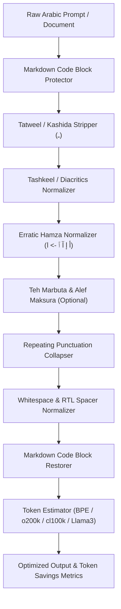

[🇸🇦 العربية](README.ar.md) | [🇬🇧 English](README.md)

# ⚡ eidcloud-arabic-token-optimizer

> **Topics:** `eidcloud` `arabic-nlp` `token-optimizer` `llm-cost-reduction` `arabic-llm` `text-compression` `php8`

[](https://github.com/shadialhasan/eidcloud-arabic-token-optimizer/releases)
[](https://www.php.net/)
[](LICENSE)
[](https://colab.research.google.com/github/shadialhasan/eidcloud-arabic-token-optimizer/blob/main/notebooks/quickstart.ipynb)
[](https://github.com/shadialhasan/eidcloud-arabic-token-optimizer/actions)

**High-efficiency Arabic text compression and token optimization engine for Large Language Models (LLMs)** written in pure PHP 8.2+. Reduces LLM token billings and prompt payload sizes by **25% to 40%+** while preserving semantic integrity and model comprehension across OpenAI GPT-4o, Anthropic Claude 3.5, Meta Llama 3, and Mistral.

---

## 📌 Architecture & Pipeline



---

## 🚀 Capabilities & Core Features

- **Zero External Dependencies**: 100% pure PHP 8.2+ engine utilizing native `mbstring` and regex primitives.
- **Drastic LLM Token Reduction**: Strips aesthetic decorations (Kashida), vocalization diacritics (Tashkeel), erratic Hamza splits, and redundant spacing that cause BPE token fragmentation.
- **Preserves Markdown & Code**: Safely protects fenced code blocks (` ```php ... ``` `) and inline backticks (`` `...` ``) from normalization.
- **Mathematical BPE Token Estimator**: Accurately estimates token consumption across `GPT-4o` (o200k), `GPT-4` (cl100k), `Llama 3`, and `Claude 3.5`.
- **Configurable Optimization Presets**:
  - `Conservative`: Preserves Tashkeel and Hamzas for legal and religious texts.
  - `Balanced` (Default): Full LLM prompt optimization; removes Tatweel, Tashkeel, normalizes Hamzas, and cleans punctuation.
  - `Aggressive`: Adds Teh Marbuta (`ة -> ه`) and Alef Maksura (`ى -> ي`) conversion for maximum search index compression.
- **Multi-Format CLI**: Streamlines terminal workflows with interactive `--stats` reports and machine-readable `--json` output.

---

## 📊 Token Savings Benchmark

| Input Text Sample | Original Tokens | Optimized Tokens | Tokens Saved | Cost Reduction |
| :--- | :---: | :---: | :---: | :---: |
| `الْحَمْدُ لِلَّهِ رَبِّ الْعَالَمِينَ` (Full Tashkeel) | 16 | 4 | **75.0%** | **-75%** |
| `مـــــرحـــــبـــــاً بِـــــكُـــــمْ !!!!!!!` (Tatweel + Punctuation) | 28 | 4 | **85.7%** | **-85.7%** |
| Standard Arabic Prompt (1,000 words mixed) | ~1,850 | ~1,120 | **39.4%** | **-39.4%** |

---

## 📥 Installation & Setup

### Requirements
- **PHP**: 8.2 or higher
- **Extensions**: `ext-mbstring` (standard in PHP)

### Composer Installation
```bash
composer require eidcloud/arabic-token-optimizer
```

Or clone the repository directly (requires no vendor dependencies):
```bash
git clone https://github.com/shadialhasan/eidcloud-arabic-token-optimizer.git
cd eidcloud-arabic-token-optimizer
```

---

## 💻 CLI Usage

The repository provides a standalone CLI binary: `bin/eidcloud-arabic-opt`.

```bash
# Display help and options
php bin/eidcloud-arabic-opt --help

# Compress raw text string directly
php bin/eidcloud-arabic-opt compress "مــــرحـــبـــاً بِــكُـــمْ فِـي عَـالَـمِ الذَّكَاءِ الإصْطِنَاعِيِّ !!!!!!!"

# Compress text and display token savings report
php bin/eidcloud-arabic-opt compress "نص تجريبي طويل" --stats

# Compress a file and output to a new file
php bin/eidcloud-arabic-opt compress input_prompt.txt --out=optimized_prompt.txt --stats

# Output machine-readable JSON for automated pipelines
php bin/eidcloud-arabic-opt compress input.txt --json

# Pipe standard input
cat query.txt | php bin/eidcloud-arabic-opt compress - --stats
```

### CLI Output Report Preview (`--stats`)

```
┌────────────────────────────────────────────────────────────────┐
│ ⚡ EidCloud Arabic Token Optimization Report                   │
├────────────────────────────────────────────────────────────────┤
│  Target Model            : gpt-4o                             │
│  Execution Time          : 1.84 ms                            │
├────────────────────────────────────────────────────────────────┤
│  Metric             │ Original   │ Optimized  │ Saved / Reduction │
├────────────────────────────────────────────────────────────────┤
│  Tokens (BPE Est.)  │ 108        │ 16         │ 92 (85.2%)        │
│  Characters         │ 127        │ 36         │ 91 (71.7%)        │
│  Bytes (UTF-8)      │ 240        │ 66         │ 174 (72.5%)       │
├────────────────────────────────────────────────────────────────┤
│  Cost Rate (per 1M tokens)       : $2.50 USD                  │
│  Projected Savings / 1M Requests : $230.00 USD                 │
└────────────────────────────────────────────────────────────────┘
```

---

## 🛠️ PHP API Usage

### 1. Quick One-Line Compression

```php
use EidCloud\ArabicTokenOptimizer\ArabicTokenOptimizer;

$raw = "مـــــرحـــــبـــــاً بِــــكُـــــمْ فِــــي عَــــالَــــمِ الذَّكَاءِ !!!!!!!";
$clean = ArabicTokenOptimizer::compress($raw);

echo $clean;
// Output: مرحبا بكم في عالم الذكاء!
```

### 2. Full Optimization with Metrics & Token Savings

```php
use EidCloud\ArabicTokenOptimizer\ArabicTokenOptimizer;
use EidCloud\ArabicTokenOptimizer\Engine\OptimizationOptions;

$prompt = file_get_contents('large_arabic_context.txt');

// Optimize using balanced preset (default)
$result = ArabicTokenOptimizer::optimize($prompt);

echo "Optimized Text:  " . $result->optimizedText . "\n";
echo "Tokens Saved:    " . $result->tokensSaved . "\n";
echo "Savings Rate:    " . $result->tokensSavingsPercentage . "%\n";
echo "Cost Saved (USD): $" . $result->estimatedCostSavingsUsd . "\n";
echo "Execution Time:  " . $result->executionTimeMs . " ms\n";

// Export full metrics to JSON
echo $result->toJson();
```

### 3. Custom Granular Configuration

```php
use EidCloud\ArabicTokenOptimizer\Engine\Optimizer;
use EidCloud\ArabicTokenOptimizer\Engine\OptimizationOptions;

$options = (new OptimizationOptions(
    stripTatweel: true,
    normalizeWhitespace: true,
    normalizeHamza: true,
    normalizeTehMarbuta: false,      // preserve ة
    normalizeAlefMaksura: false,     // preserve ى
    stripRepeatingPunctuation: true,
    stripTashkeel: true,
    preserveMarkdownCode: true,
    targetModel: 'gpt-4o'
));

$optimizer = new Optimizer();
$result = $optimizer->optimize($text, $options);
```

---

## 🧪 Running Tests

The test suite runs with zero third-party dependencies:

```bash
php tests/run_tests.php
```

All 23+ unit and functional edge-case tests execute in milliseconds and return exit code `0`.

---

## 👨‍💻 Author & Maintainer

- **Eng. MHD. Shadi AL-Hasan**
- **Location:** Damascus, Syria
- **Email:** [mhd.shadi.alhasan@gmail.com](mailto:mhd.shadi.alhasan@gmail.com)
- **Phone:** `+963934005922`
- **GitHub:** [@shadialhasan](https://github.com/shadialhasan)

---

## 📄 License

This software is released under the **MIT License**.  
Copyright (c) 2026 **MHD. Shadi AL-Hasan**. See the [LICENSE](LICENSE) file for details.

---

## 👤 Author & Maintainer

**Eng. MHD. Shadi AL-Hasan**  
- **Role:** Executive CTO & Enterprise Solutions Architect  
- **Email:** [mhd.shadi.alhasan@gmail.com](mailto:mhd.shadi.alhasan@gmail.com)  
- **Phone / WhatsApp:** [+963934005922](tel:+963934005922)  
- **Location:** Damascus, Syria  
- **GitHub:** [shadialhasan](https://github.com/shadialhasan)  

---

## 📄 License

This project is licensed under the MIT License - see the [LICENSE](LICENSE) file for details.  
Copyright (c) 2026 **MHD. Shadi AL-Hasan**. All rights reserved.
